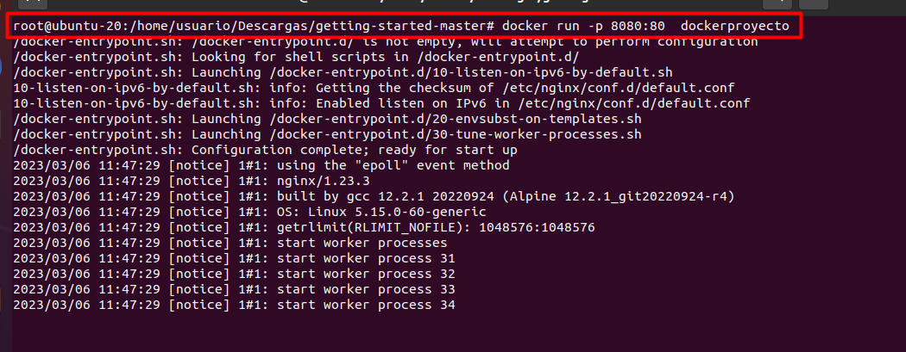

# Práctica 2 - Despliegue de aplicaciones con Docker
## Se propone la puesta en marcha de un servidor Docker y el desarrollo de las prácticas especificadas en el tema de “Introducción a Docker”
Se incluirá:
- Puesta en marcha en local.
- Se alojará el código de las prácticas propuestas en GitHub

## Docker. Práctica 1

Instala Docker en Ubuntu:

## Docker. Práctica 2

### Lleva a cabo la práctica descrita en el primer artículo
- Ejecuta la imagen "hello-world"

- Muestra las imágenes Docker instaladas
- Muestra los contenedores Docker

### Lleva a cabo la práctica descrita en el segundo artículo
- Edita el fichero Dockerfile

Vamos a la carpeta.

Editamos el archivo docker:

- Construye el contenedor

- Ejecútalo

- Create una cuenta en hub.docker.com

- Publícalo

## Docker. Práctica 3

- Descarga la imagen de ubuntu
- Descarga la imagen de hello-world
- Descarga la imagen nginx
- Muestra un listado de todas la imágenes
- Ejecuta un contenedor hello-world y dale nombre “myhello1”
- Ejecuta un contenedor hello-world y dale nombre “myhello2”
- Ejecuta un contenedor hello-world y dale nombre “myhello3”
- Muestra los contenedores que se están ejecutando
- Para el contenedor "myhello1”
- Para el contenedor "myhello2”
- Borra el contenedor “myhello1”
- Muestra los contenedores que se están ejecutando.
- Borra todos los contenedores

## Docker. Práctica 4

### Lee la documentación del módulo tres “Almacenamiento y redes Docker” del curso:
https://github.com/josedom24/curso_docker_ies

- Lleva a cabo al menos tres de los ejemplos mostrados en el módulo y documentalo en tu repositorio incluyendo capturas de pantalla.

## Docker. Práctica 5

### Lee la documentación del módulo cuatro “Docker-compose” del curso:
https://github.com/josedom24/curso_docker_ies

- Lleva a cabo al menos tres de los ejemplos mostrados en el módulo y documentalo en tu repositorio incluyendo capturas de pantalla.

