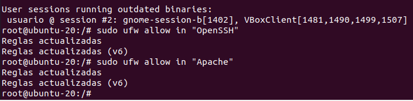
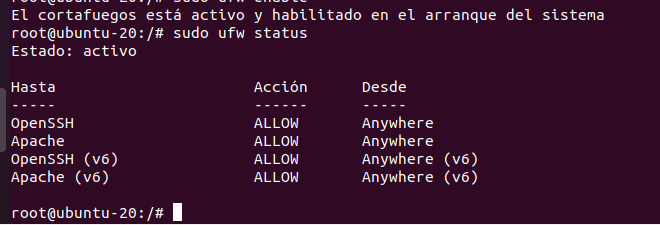
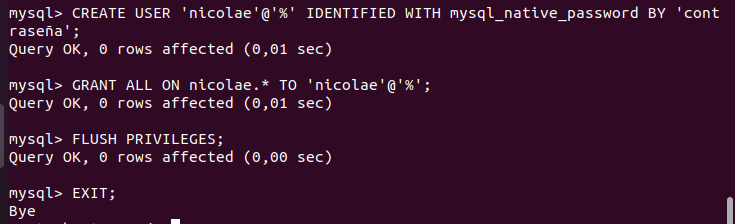
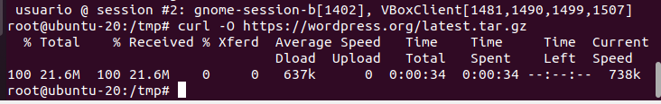
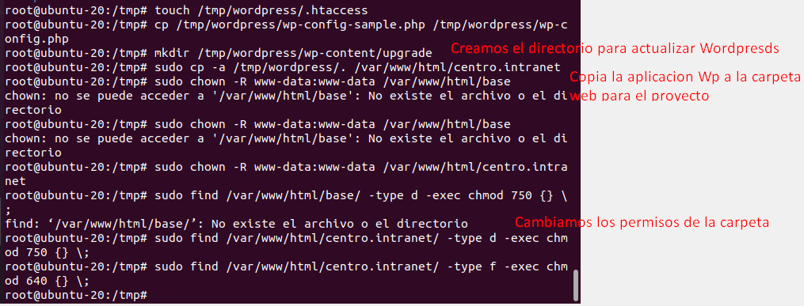
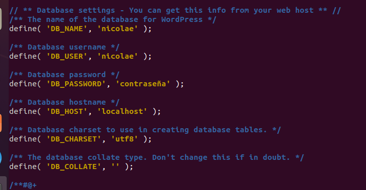
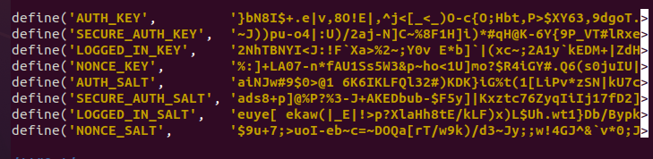

# Practica Servidor Web 1ºTrimestre

## - Instalación del servidor web apache. Usaremos dos dominios mediante el archivo hosts: centro.intranet y departamentos.centro.intranet. El primero servirá el contenido mediante wordpress y el segundo una aplicación en python

Empezamos usando el comando :

``` sudo apt update ```

Usando sudo nano modificamos el archivo /etc/hosts para añadir los dominions


Instalación entorno LAMP con el comando

``` sudo apt install apache2 ```

## - Activar los módulos necesarios para ejecutar php y acceder a mysql

Instalamos el php con 

``` sudo apt install php y openssh-server ```





Instalamos Mysql

``` sudo apt install mysql-server ```

Creamos un alojamiento virtual para el sitio web

``` sudo mkdir /var/www/html/centro.intranet ```

Abrimos el archivo de configuración en el directorio sites-available con la siguente configuracion


Ahora habilitamos el host virtual en apache y recargamos apache


## - Instalamos y Configuramos Wordpress

Creación de una base de datos de MySQL y un usuario para WordPress.

``` mysql -u root -p ```




Instalación de extensiones de PHP adicionales

Actualizamos el sistema con

``` sudo apt update ```

Instalamos los módulos requeridos con

``` sudo apt install php-curl php-gd php-mbstring php-xml php-xmlrpc php-soap php-intl php-zip ```

Reinicia el servicio apache para activar los módulos que acabas de instalar

``` sudo systemctl restart apache2 ```


Descargamos Wordpress. Esto lo vamos a hacer con una erramienta que se llama curl.

``` cd /tmp ```

``` sudo apt install curl ```

``` curl -O https://wordpress.org/latest.tar.gz ```



Procedemos a decomprimir con 

``` tar xzvf latest.tar.gz ```

creamos el archivo .htaccess

``` touch /tmp/wordpress/.htaccess ```




Cambiamos el nombre de la base de datos, el nombre de usuario y su contraseña, además de las claves de seguridad que hemos obtenido antes.





Y añadimos al final del fichero config la siguiente línea

``` ruby
define('FS_METHOD', 'direct');
```

Ya tenemos instalado Wordpress y ahora accedemos via Web a nuestro servidor

``` https://centro.intranet ```


## - Instala y configura awstat.

Instalamos el AWastat con el comando 

``` sudo apt-get install awstats ```

Ahora creamos un archivo de configuracion para el dominio centro.intranet.

Duplicamos el archivo de configuracion por defecto.

``` sudo cp /etc/awstats/awstats.conf /etc/awstats/awstats.centro.intranet.conf ```

Ahora le ponemos la siguente configuracion con el comando:

``` sudo nano /etc/awstats/awstats.conf  ```


Ahora generamos las estadisticas iniciales


Configuramos apache para AWstats

Ahora copiamos el contenido de la carpeta «cgi-bin» en el directorio raíz del documento por defecto de su instalación de Apache. Por defecto se encuentra en la carpeta «/usr/lib/cgi-bin».

``` sudo cp -r /usr/lib/cgi-bin /var/www/html/ ```

``` sudo chown www-data:www-data /var/www/html/cgi-bin/ ```

``` sudo chmod -R 755 /var/www/html/cgi-bin/ ```

Ahora accedemos a la pagina

https://centro.intranet/cgi-bin/awstats.pl?config=centro.intranet


## - Instala un segundo servidor de tu elección (nginx, lighttpd) bajo el dominio “servidor2.centro.intranet”. Debes configurarlo para que sirva en el puerto 8080 y haz los cambios necesarios para ejecutar php. Instala phpmyadmin.

Vamos a instalar Nginx con el siguente comando

``` sudo apt install nginx ```

Probamos el servidor en el navegador


Cambiamos el puerto a 8080 con el siguente comando

``` sudo nano /etc/nginx/sites-available/default ```


Y lo probamos en el navegador


Instalamos MySQL

``` apt-get update ```

``` apt-get install mysql-server mysql-client ```

Accedemos al servicio de comandos MySQL

``` mysql -u root -p ```

Establecemos una contraseña para el usuario raiz de MySQL

``` ruby

ALTER USER 'root'@'localhost' IDENTIFIED WITH mysql_native_password BY 'usuario';
FLUSH PRIVILEGES;
exit

```

Creamos una base de datos llamada phpmyadmin

``` ruby
CREATE DATABASE phpmyadmin CHARACTER SET UTF8 COLLATE UTF8_BIN;
```

Creamos una cuenta de usuario de Mysql denominada PMA

``` ruby
CREATE USER 'pma'@'%' IDENTIFIED BY 'usuario';
```

Concedemos el permiso de cuenta de usuario de PMA sobre la base de datos denominada PHPMYADMIN.

``` ruby
GRANT ALL PRIVILEGES ON phpmyadmin .* TO 'pma'@'%';
exit
```

Descargamos el paquete de instalación de PhpMyAdmin.

``` mkdir /downloads ```

``` cd /downloads ```

``` wget https://files.phpmyadmin.net/phpMyAdmin/4.9.5/phpMyAdmin-4.9.5-all-languages.tar.gz ```

``` tar -zxvf phpMyAdmin-4.9.5-all-languages.tar.gz ```

Importamos la plantilla de base de datos de PhpMyAdmin utilizando la cuenta denominada PMA.

``` cd /downloads/phpMyAdmin-4.9.5-all-languages/sql ```

``` mysql -u pma -p phpmyadmin < create_tables.sql ```

Ahora todos los paquetes necesarios para nginx.

``` apt-get install nginx apache2-utils mlocate ```

Instalamos el paquete PHP.

``` apt-get install php-fpm ```

Instalamos los modulos PHP

``` apt-get install php-mysql php-gd php-json php-bcmath php-xml php-mbstring php-zip php-apcu php-curl  ```


