# Practica Servidor Web 1ºTrimestre

## - Instalación del servidor web apache. Usaremos dos dominios mediante el archivo hosts: centro.intranet y departamentos.centro.intranet. El primero servirá el contenido mediante wordpress y el segundo una aplicación en python

Empezamos usando el comando :

``` sudo apt update ```

Usando sudo nano modificamos el archivo /etc/hosts para añadir los dominions

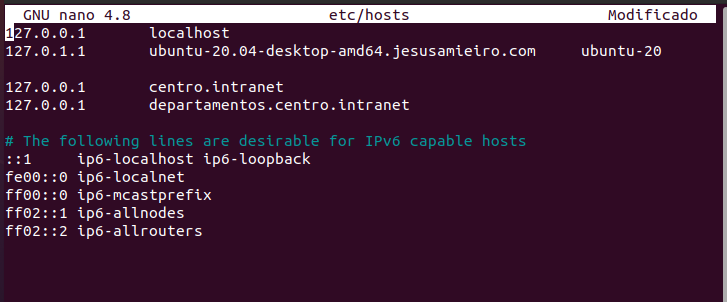

Instalación entorno LAMP con el comando

``` sudo apt install apache2 ```

### - Activar los módulos necesarios para ejecutar php y acceder a mysql

Instalamos el php con 

``` sudo apt install php y openssh-server ```

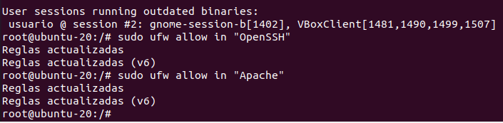

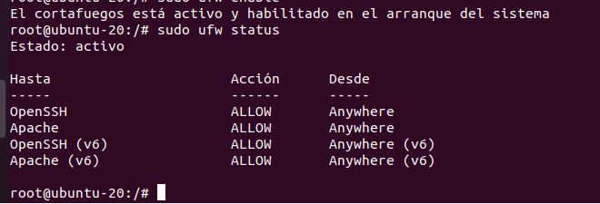

Instalamos Mysql

``` sudo apt install mysql-server ```

Creamos un alojamiento virtual para el sitio web

``` sudo mkdir /var/www/html/centro.intranet ```

Abrimos el archivo de configuración en el directorio sites-available con la siguente configuracion

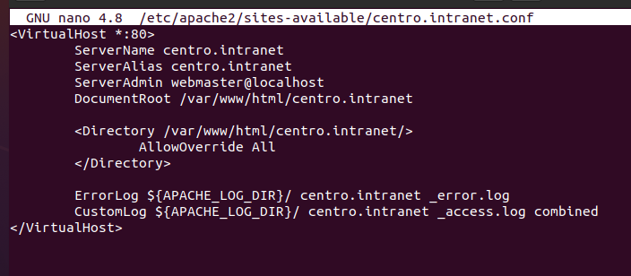

Ahora habilitamos el host virtual en apache y recargamos apache

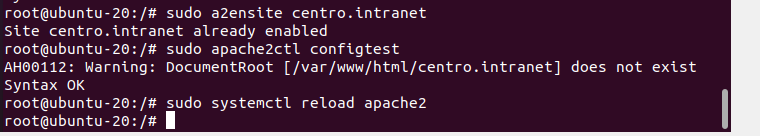

### - Instalamos y Configuramos Wordpress

Creación de una base de datos de MySQL y un usuario para WordPress.

``` mysql -u root -p ```

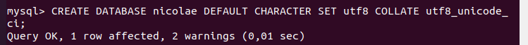

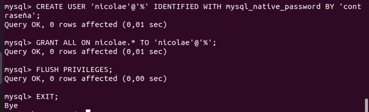

Instalación de extensiones de PHP adicionales

Actualizamos el sistema con

``` sudo apt update ```

Instalamos los módulos requeridos con

``` sudo apt install php-curl php-gd php-mbstring php-xml php-xmlrpc php-soap php-intl php-zip ```

Reinicia el servicio apache para activar los módulos que acabas de instalar

``` sudo systemctl restart apache2 ```

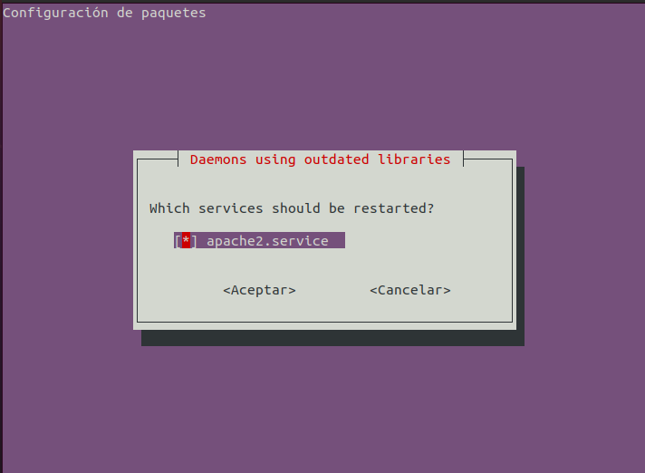

Descargamos Wordpress. Esto lo vamos a hacer con una erramienta que se llama curl.

``` cd /tmp ```

``` sudo apt install curl ```

``` curl -O https://wordpress.org/latest.tar.gz ```

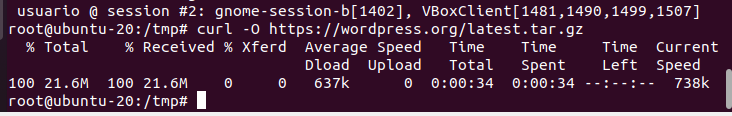

Procedemos a decomprimir con 

``` tar xzvf latest.tar.gz ```

creamos el archivo .htaccess

``` touch /tmp/wordpress/.htaccess ```

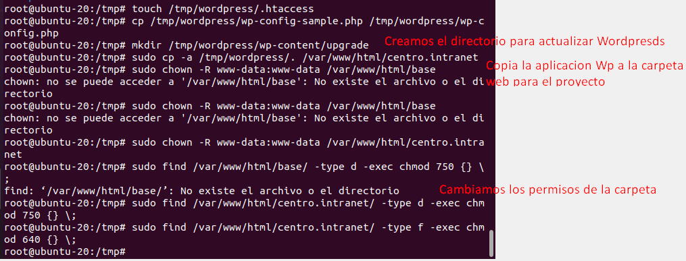

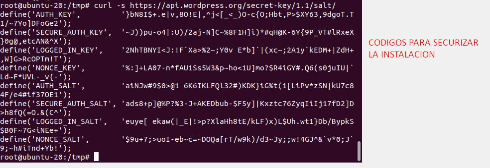

Cambiamos el nombre de la base de datos, el nombre de usuario y su contraseña, además de las claves de seguridad que hemos obtenido antes.

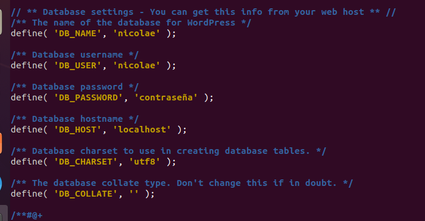

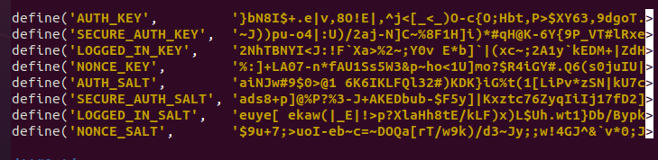

Y añadimos al final del fichero config la siguiente línea

``` ruby
define('FS_METHOD', 'direct');
```

Ya tenemos instalado Wordpress y ahora accedemos via Web a nuestro servidor

``` https://centro.intranet ```

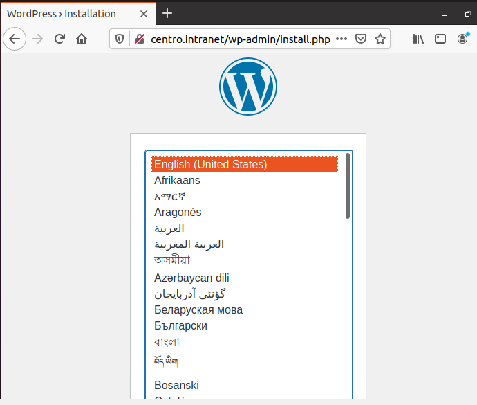


