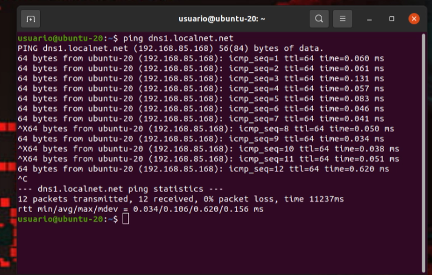
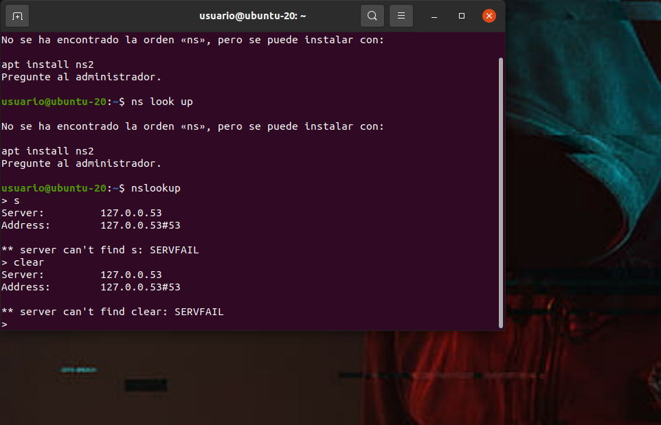

# Practica 1 - Servidor alojamiento web

## Se pide las instalación, configuración y puesta en marcha de un servidor que ofrezca servicio de alojamiento web configurable

* Se dará alojamiento a páginas web tanto estáticas como dinámicas con “php”
* Los clientes dispondrán de un directorio de usuario con una página web por defecto.
* Además contarán con una base de datos sql que podrán administrar con phpmyadmin
* Los clientes podrán acceder mediante ftp para la administración de archivos configurando adecuadamente TLS
* Se habilitará el acceso mediante ssh y sftp.
* Se configura de forma adecuada postfix y dovecot imap y pop3
* Se automatizará mediante el uso de scripts:
    * La creación de usuarios y del directorio correspondiente para el alojamiento web
    * Host virtual en apache
    * Creación de usuario del sistema para acceso a ftp, ssh, smtp, …
    * Se creará un subdominio en el servidor DNS con las resolución directa e inversa
    * Se creará una base de datos además de un usuario con todos los permisos sobre dicha base de datos (ALL PRIVILEGES)
    * Se habilitará la ejecución de aplicaciones Python con el servidor web

### Para la instalación, configuración y puesta en marcha del servidor mencionado usare Ubuntu-Desktop.


Vamos a configurar el servidor Apache para ejecutar PHP e introducimos el siguente comando:

``` sudo nano /etc/apache2/mods-enabled/dir.conf ```

y cambiamos la lista de indices para dejarla en el siguente orden:

``` ruby
DirectoryIndex index.php index.html index.cgi index.pl index.xhtml index.htm
```
Comprobamos que en este archivo

```
root@ubuntu-20:/etc/apache2/mods-available# sudo nano php7.4.conf
```
contenga:
``` ruby

<FilesMatch ".+\.ph(ar|p|tml)$">
    SetHandler application/x-httpd-php
</FilesMatch>

```

Script:

``` ruby
#! /bin/bash

user=$1

if [ -z "$user" ]; then
  echo "Debe proporcionar un nombre de usuario como argumento."
  exit 1
fi

mysql -u root -e "CREATE DATABASE $user;"

mysql -u root -e "USE $user;"

mysql -u root -e "CREATE USER '$user'@'localhost' IDENTIFIED BY '12345';GRANT ALL PRIVILEGES ON $user.* TO '$user'@'localhost';"

mkdir /var/www/html/$user
touch /var/www/html/$user/index.html
echo "<!DOCTYPE html><html><head><title>Bienvenido a mi pagina web</title></head><body><h1>Bienvenido a mi sitio web</h1><p>Esta es mi pagina de bienvenida.</p></body></html>" >> /var/www/html/$user/index.html

sudo adduser $user
sudo service vsftpd restart

#DNS
echo "$user.localnet.net.     IN     A     192.168.85.168" >> /etc/bind/db.localnet.net

#DNS inverso
echo "168      IN      PTR      $user.localnet.net." >> /etc/bind/db.85.168.192

systemctl reload bind9
```

Ejecutamos el script:

``` ruby
./ScriptDaw.sh [Parametro]
```

Insertamos el nombre y la contraseña:


Cerramos sesion y nos dirijimos al usuario que hemos creado con el script


ponemos localhost/nicoaleadrian que es el usuario que hemos creado para ver nuestra pagina web.






``` ruby

```
