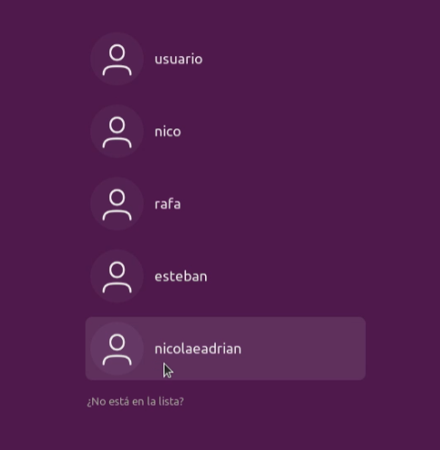

# Practica 1 - Servidor alojamiento web

## Se pide las instalación, configuración y puesta en marcha de un servidor que ofrezca servicio de alojamiento web configurable

* Se dará alojamiento a páginas web tanto estáticas como dinámicas con “php”
* Los clientes dispondrán de un directorio de usuario con una página web por defecto.
* Además contarán con una base de datos sql que podrán administrar con phpmyadmin
* Los clientes podrán acceder mediante ftp para la administración de archivos configurando adecuadamente TLS
* Se habilitará el acceso mediante ssh y sftp.
* Se configura de forma adecuada postfix y dovecot imap y pop3
* Se automatizará mediante el uso de scripts:
    * La creación de usuarios y del directorio correspondiente para el alojamiento web
    * Host virtual en apache
    * Creación de usuario del sistema para acceso a ftp, ssh, smtp, …
    * Se creará un subdominio en el servidor DNS con las resolución directa e inversa
    * Se creará una base de datos además de un usuario con todos los permisos sobre dicha base de datos (ALL PRIVILEGES)
    * Se habilitará la ejecución de aplicaciones Python con el servidor web

### Para la instalación, configuración y puesta en marcha del servidor mencionado usare Ubuntu-Desktop.

Lo primero que vamos a hacer es actualizar los paquetes con:

``` sudo apt-get update ```

Ahora vamos a instalar Apache2, PHP y libapache2-mod-php que es un módulo de Apache que permite a Apache interactuar con PHP.

``` sudo apt-get install apache2 php libapache2-mod-php ```

Probamos el servidor en el navegador:


Ahora Instalamos MySQL y PhpMyAdmin con el siguente comando:

``` sudo apt-get install mysql-server php-mysql phpmyadmin ```

Ahora copiamos el archivo de configuración de phpMyAdmin para Apache:

 ``` sudo cp /etc/phpmyadmin/apache.conf /etc/apache2/sites-available/phpmyadmin.conf ```
 
Habilitamos la configuración de phpMyAdmin en Apache:

``` sudo a2ensite phpmyadmin.conf ```

Y reiniciamos Apache para que los cambios surtan efecto:

```sudo service apache2 restart ```

Vamos a configurar el servidor Apache para ejecutar PHP e introducimos el siguente comando:

``` sudo nano /etc/apache2/mods-enabled/dir.conf ```

y cambiamos la lista de indices para dejarla en el siguente orden:

``` ruby
DirectoryIndex index.php index.html index.cgi index.pl index.xhtml index.htm
```
Comprobamos que en este archivo

```
root@ubuntu-20:/etc/apache2/mods-available# sudo nano php7.4.conf
```
contenga:
``` ruby

<FilesMatch ".+\.ph(ar|p|tml)$">
    SetHandler application/x-httpd-php
</FilesMatch>

```
para que cualquier archivo que tenga la extensión .php, .phtml, o .phar, usará el controlador "application/x-httpd-php". 

ahora nos vamos a /var/www/html/ y creamos una carpeta llamada directorioPHP
donde crearemos el siguente documento php:

``` ruby
<html>
  <head>
    <title>Ejemplo de PHP</title>
  </head>
  <body>
    <?php echo "Hola mundo"; ?>
  </body>
</html>
```

Y vamos al navegador para comprobar que todo ha salido bien:



creamos una nueva carpeta mi-sitio-web a la que le vamos a dar los siguentes permisos:

sudo chown -R www-data:www-data /var/www/html/mi-sitio-web/

y ahora creamos un archivo index.php con el mismo contenido que antes

ahora nos dirijimos a apache2/sites-available# sudo nano mi-sitio-web.conf y creamos un host virtual

``` ruby
<VirtualHost *:80>
    ServerName mi-sitio-web.com
    DocumentRoot /var/www/html/mi-sitio-web
    <Directory /var/www/html/mi-sitio-web>
        Options Indexes FollowSymLinks
        AllowOverride All
        Require all granted
    </Directory>
</VirtualHost>
```

a continuacion introducimos

``` 
sudo a2ensite mi-sitio-web.conf 
sudo systemctl restart apache2
```

y vamos al navegador para introducir la siguente ruta:

http://localhost/mi-sitio-web/

si todo fuciona tendriamos que ver el mismo holamundo de antes


``` ruby

```


