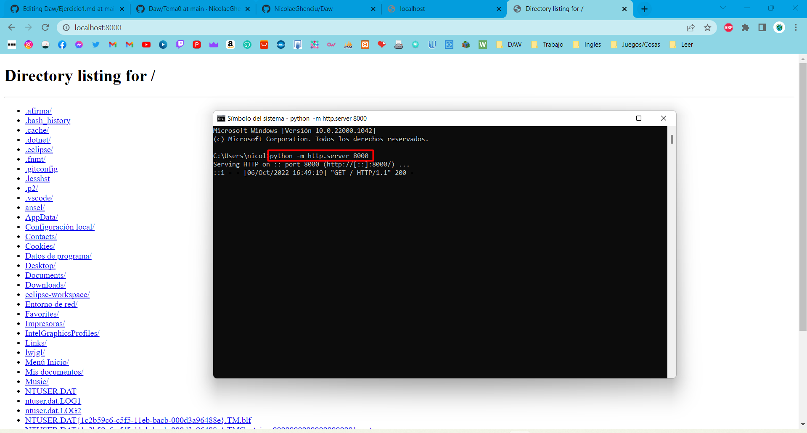
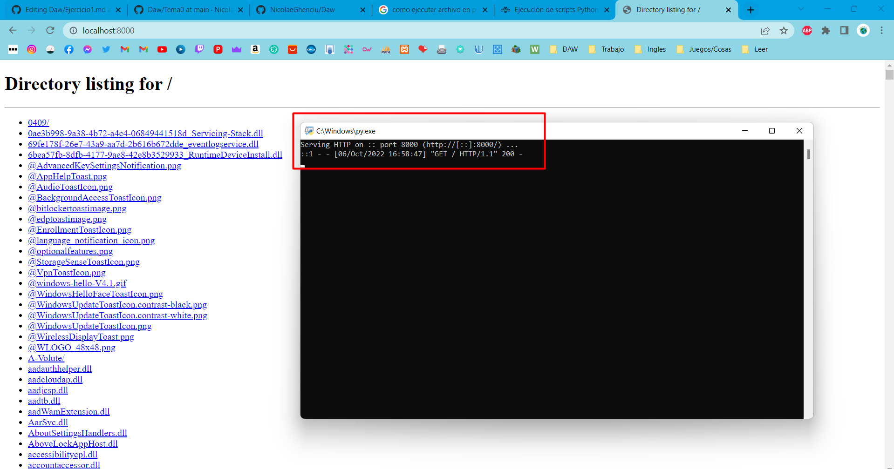
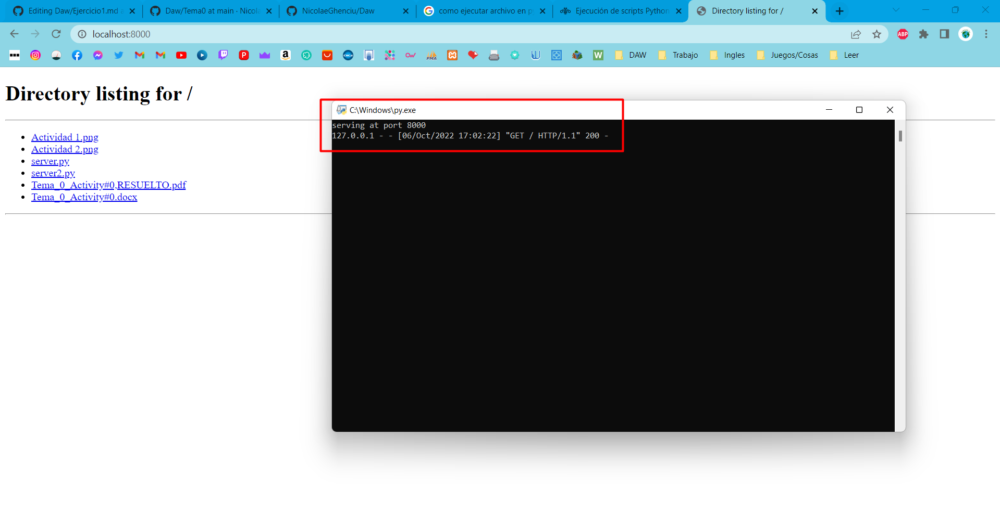

# Actividad 0.5 - Práctica servidor web
## 1. Visita los siguientes enlaces:
### Simple web server (ejemplo 1)
python -m http.server 8000

### http server (ejemplo 2)
[enlace](Ejercicio1/server.py)

### dummy web server (ejemplo 3)
[enlace](Ejercicio1/server2.py)

